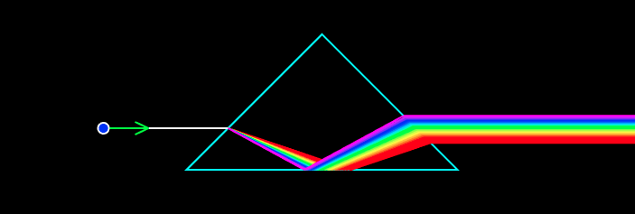

# [BUT FIT 2020] Light Dispersion
FYO (Physical Optics) school course project.
Inspiration taken from similar project of
[Romop5](https://github.com/Romop5/VUTBR-FYO-2019).

## Implementation
HTML5 + JavaScript was used to simulate dispersion
of light in ray optics via 2D raytracing algorithm
on HTML canvas.

## Dependencies
* **[jQuery 3.5.0](http://github.com)**
* **[PixiJS 5.1.5](https://www.pixijs.com/)** - WebGL 2D renderer used for all canvas drawing
* **[MathJS](https://mathjs.org/)** - math library used for vector calculations

## Authors
* **Ondřej Pavela**